# BranchLumpedConstant Model

`BranchLumpedConstant` represents a lumped-parameter EMT transmission line.
The nominal $\pi$-model is obtained by spatially discretizing the telegrapher equations over
a segment of length $\Delta x$, with a half shunt placed at each port.
Series current $\mathbf{i}$ is directed from bus 1 to bus 2. Bus residual
current injections are positive into buses. All electrical parameter matrices
are $3 \times 3$ and capture self and mutual coupling between phases.

<div align="center">
   

  Figure 1: Lumped constant EMT branch model
</div>

## Model Parameters

Symbol           | Units          | Description                              | Note
-----------------|----------------|------------------------------------------|---------------------------------
$\mathbf{R}'$    | [$\Omega$/m]   | Series resistance matrix per unit length | $\mathbb{R}^{3 \times 3}$
$\mathbf{L}'$    | [H/m]          | Series inductance matrix per unit length | $\mathbb{R}^{3 \times 3}$
$\mathbf{G}'$    | [S/m]          | Shunt conductance matrix per unit length | $\mathbb{R}^{3 \times 3}$
$\mathbf{C}'$    | [F/m]          | Shunt capacitance matrix per unit length | $\mathbb{R}^{3 \times 3}$
$\Delta x$       | [m]            | Line segment length                      | $\mathbb{R}$

## Model Derived Parameters

``` math
\begin{aligned}
  \mathbf{R} &= \mathbf{R}'\Delta x   & \mathbf{G} &= \mathbf{G}'\Delta x \\
  \mathbf{L} &= \mathbf{L}'\Delta x   & \mathbf{C} &= \mathbf{C}'\Delta x
\end{aligned}
```

## Model Variables

### Internal Variables

#### Differential

Symbol           | Units  | Description           | Note
-----------------|--------|-----------------------|---------------------------------
$\mathbf{i}$   | [A]    | Series branch current, directed bus 1 to bus 2 | $\mathbf{i} = [i_a, i_b, i_c]^T \in \mathbb{R}^3$

#### Algebraic

None.

### External Variables

External variables enter component model equations but are owned by
other components. The EMT bus at each port owns the voltage
variable and provides the equation needed to have a balanced system
of equations.

#### Differential

Symbol           | Units  | Description              | Note
-----------------|--------|--------------------------|------------------
$\mathbf{v}_1$   | [V]    | Port voltage at bus 1, owned by bus 1 | $\mathbf{v}_1 = [v_{1,a}, v_{1,b}, v_{1,c}]^T \in \mathbb{R}^3$
$\mathbf{v}_2$   | [V]    | Port voltage at bus 2, owned by bus 2 | $\mathbf{v}_2 = [v_{2,a}, v_{2,b}, v_{2,c}]^T \in \mathbb{R}^3$

#### Algebraic

None.

## Model Equations

### Differential Equations


``` math
0 = \mathbf{R}\,\mathbf{i} + \mathbf{L}\dot{\mathbf{i}} + \mathbf{v}_2 - \mathbf{v}_1
```

### Algebraic Equations

None.

### Bus Residual Contributions

The lumped line contributes to the KCL residual at each port bus.
Each expression is accumulated into the owning bus residual.

``` math
\mathbf{i}^\text{inj}_1 := - \dfrac{\mathbf{G}}{2}\,\mathbf{v}_1 - \dfrac{\mathbf{C}}{2}\,\dot{\mathbf{v}}_1 - \mathbf{i}
```

``` math
\mathbf{i}^\text{inj}_2 := - \dfrac{\mathbf{G}}{2}\,\mathbf{v}_2 - \dfrac{\mathbf{C}}{2}\,\dot{\mathbf{v}}_2 + \mathbf{i}
```

## Initialization

The initialization uses the physical branch parameters and the connected bus
initial RMS phase-voltage phasors. With $\mathbf{V}_1$ and $\mathbf{V}_2$
denoting RMS phase-voltage phasors and $\omega$ denoting the common port
angular frequency,

``` math
\mathbf{Z} = \mathbf{R} + j\omega\mathbf{L}
```

``` math
\mathbf{I} = \mathbf{Z}^{-1}\left(\mathbf{V}_1 - \mathbf{V}_2\right)
```

The instantaneous initial current and derivative are:

``` math
\mathbf{i}(0) = \sqrt{2}\,\Re(\mathbf{I})
```

``` math
\dot{\mathbf{i}}(0) = \sqrt{2}\,\Re(j\omega\mathbf{I})
```

## Model Outputs

There are no EMT signal outputs. Candidate future monitor quantities include
the series branch current components $i_a$, $i_b$, and $i_c$.

Port current injection expressions are documented above as
$\mathbf{i}^\text{inj}_1$ and $\mathbf{i}^\text{inj}_2$.
