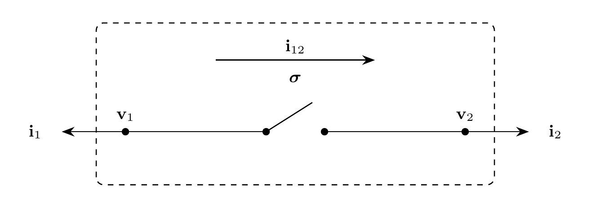

# Switch Model

`Switch` represents an ideal $N$-pole switch between two $N$-phase EMT buses.
Series current $\mathbf{i}_{12}$ is directed from terminal 1 to terminal 2. Each
pole has a component-owned discrete state $\sigma_n$, where $0$ is open and $1$
is closed. The discrete state is not a DAE variable or a signal port. The switch
contains no energy storage. Switching transients arise from the connected EMT
network.

## Block Diagram



Figure 1: Switch model

## Model Parameters

Symbol | Units | JSON | Description | Note
------ | ----- | ---- | ----------- | ----
$N$ | [-] | `N` | Number of poles | Required, positive integer
$\boldsymbol{\sigma}^{\mathrm{init}}$ | [-] | `state0` | Initial pole states | Boolean vector of length $N$, `false` open and `true` closed

### Parameter Validation

```math
\begin{aligned}
N &\in \mathbb{Z}_{>0} \\
\boldsymbol{\sigma}^{\mathrm{init}} &\in \{0,1\}^N
\end{aligned}
```

### Derived Parameters

Define the pole-index set

```math
\mathcal{N} = \{1,\ldots,N\}.
```

## Submodels

None.

### Submodel Validation

None.

## Model Variables

### Internal Variables

#### Differential

None.

#### Algebraic

Symbol | Units | Description | Note
------ | ----- | ----------- | ----
$\mathbf{i}_{12}$ | [A] | Series current from terminal 1 to terminal 2 | $\mathbf{i}_{12} \in \mathbb{R}^N$

### External Variables

#### Differential

Symbol | Units | Description | Note
------ | ----- | ----------- | ----
$\mathbf{v}_1$ | [V] | Terminal 1 voltage owned by EMT bus | $\mathbf{v}_1 \in \mathbb{R}^N$
$\mathbf{v}_2$ | [V] | Terminal 2 voltage owned by EMT bus | $\mathbf{v}_2 \in \mathbb{R}^N$

#### Algebraic

None.

## Model Ports

Symbol | Port | Type | Units | Description | Note
------ | ---- | ---- | ----- | ----------- | ----
$\mathbf{v}_1$ | `v1` | Input | [V] | Terminal 1 bus voltage | $\mathbf{v}_1 \in \mathbb{R}^N$
$\mathbf{v}_2$ | `v2` | Input | [V] | Terminal 2 bus voltage | $\mathbf{v}_2 \in \mathbb{R}^N$
$\mathbf{i}_1$ | `i1` | Output | [A] | Current injection at terminal 1 | $\mathbf{i}_1 \in \mathbb{R}^N$
$\mathbf{i}_2$ | `i2` | Output | [A] | Current injection at terminal 2 | $\mathbf{i}_2 \in \mathbb{R}^N$

## Model Equations

### Differential Equations

None.

### Algebraic Equations

For each $n \in \mathcal{N}$,

```math
0 =
\begin{cases}
i_{12,n}, & \sigma_n = 0 \\
v_{2,n}-v_{1,n}, & \sigma_n = 1.
\end{cases}
```

The open state enforces zero branch current. The closed state enforces zero
terminal voltage difference. The model retains one algebraic current variable
and one algebraic residual row per pole in both states. Its union Jacobian
structure with respect to $i_{12,n}$, $v_{1,n}$, and $v_{2,n}$ is fixed across
state changes.

After a pole-state change, differential states are preserved and the assembled
solver recomputes consistent algebraic variables and derivatives. Closing a
pole across unequal differential terminal voltages or opening the only path for
nonzero differential current requires an impulse and is outside this ideal
finite-variable model.

### Wiring

```math
\begin{aligned}
\mathbf{i}_1 &\leftarrow -\mathbf{i}_{12} \\
\mathbf{i}_2 &\leftarrow \mathbf{i}_{12}.
\end{aligned}
```

## Initialization

### Input Initialization

For $r \in \{1,2\}$,

```math
\begin{aligned}
\mathbf{V}_r
  &\leftarrow \text{solved terminal RMS voltage phasor} \\
\mathbf{v}_r
  &\leftarrow \sqrt{2}\,\mathrm{Re}(\mathbf{V}_r) \\
\dfrac{\mathrm{d}\mathbf{v}_r}{\mathrm{d}t}
  &\leftarrow \sqrt{2}\,\mathrm{Re}(s_0\mathbf{V}_r).
\end{aligned}
```

### Internal Initialization

The assembled harmonic network supplies the switch-current phasor. Closed-pole
current cannot be recovered locally from the zero terminal-voltage difference.

```math
\begin{aligned}
\boldsymbol{\sigma}
  &\leftarrow \boldsymbol{\sigma}^{\mathrm{init}} \\
\mathbf{I}_{12}
  &\leftarrow \text{solved switch RMS current phasor} \\
\mathbf{i}_{12}
  &\leftarrow \sqrt{2}\,\mathrm{Re}(\mathbf{I}_{12}) \\
\dfrac{\mathrm{d}\mathbf{i}_{12}}{\mathrm{d}t}
  &\leftarrow \sqrt{2}\,\mathrm{Re}(s_0\mathbf{I}_{12}).
\end{aligned}
```

The solved phasors must satisfy the algebraic equations for
$\boldsymbol{\sigma}^{\mathrm{init}}$.

### Output Initialization

For $r \in \{1,2\}$,

```math
\begin{aligned}
\mathbf{I}_1
  &\leftarrow -\mathbf{I}_{12} \\
\mathbf{I}_2
  &\leftarrow \mathbf{I}_{12} \\
\mathbf{i}_r
  &\leftarrow \sqrt{2}\,\mathrm{Re}(\mathbf{I}_r) \\
\dfrac{\mathrm{d}\mathbf{i}_r}{\mathrm{d}t}
  &\leftarrow \sqrt{2}\,\mathrm{Re}(s_0\mathbf{I}_r).
\end{aligned}
```

## Monitors

Monitor | Units | Description | Note
------- | ----- | ----------- | ----
`state` | [-] | Pole states | $\boldsymbol{\sigma} \in \{0,1\}^N$
`i12` | [A] | Series current from terminal 1 to terminal 2 | $\mathbf{i}_{12} \in \mathbb{R}^N$
