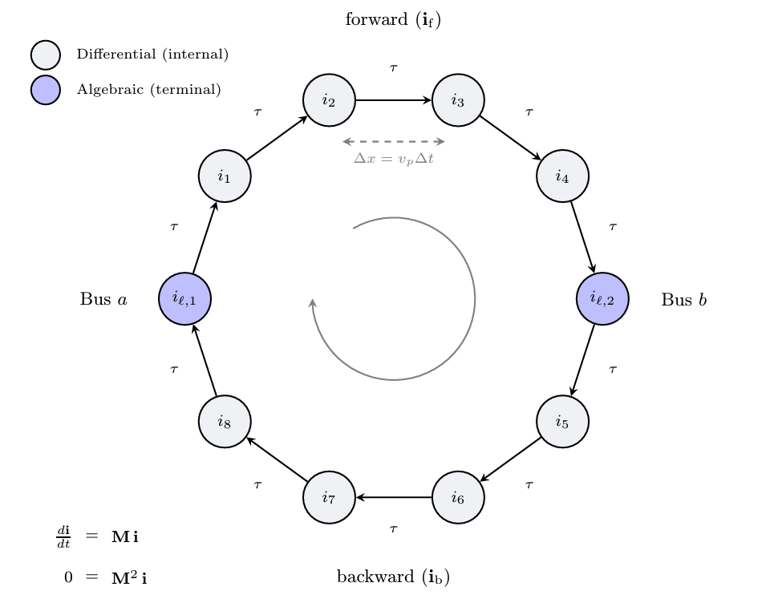

# Propagation Model

This propagation model is designed specifically for an adpative time-step integration, which allows us to bypass the typical upper bound on time step interval. This is technically a smooth approximation of wave-front propagation.

<div align="center">
   

  Figure 1: Lumped constant EMT branch model
</div>

## Model Parameters

Symbol           | Units          | Description                              | Note
-----------------|----------------|------------------------------------------|---------------------------------
$\tau_{\min}$    | [s]   | Series resistance matrix per unit length |
$\Delta t_{\min}$  | [s]          | Series inductance matrix per unit length | $\mathbb{R}^{3 \times 3}$


## Model Derived Parameters

The incidence matrix $\mathbf{A}$ is that of a directed ring.
``` math
\begin{aligned}
N&=\,\text{floor}\left(\dfrac{\tau_{\min}}{\Delta t_{\min}}\right) \\
G&= \dfrac{\tau_{\min}}{2\Delta t_{\min}}\\
\mathbf{H}&=G\mathbf{A}
\end{aligned}
```

## Model Variables

### Internal Variables

#### Differential

Symbol           | Units  | Description           | Note
-----------------|--------|-----------------------|---------------------------------
$\mathbf{i}$   | [A]    | Series branch current, directed bus 1 to bus 2 | The size of this vector will depend on the parameters

#### Algebraic

None.

### External Variables


#### Differential

Symbol           | Units  | Description              | Note
-----------------|--------|--------------------------|------------------
$\mathbf{i}_\text{inj}$   | [A]    | Injections into the line |

#### Algebraic

None.

## Model Equations

### Differential Equations

General equation, but the two equations of the terminal states are excluded.
``` math
0= - \dot{\mathbf{i}} + \mathbf{H}\mathbf{i}
```

### Algebraic Equations

General Equation, but only the two equatiosn of the terminal states are included.
``` math
0= - \dot{\mathbf{i}}_\text{inj} + \mathbf{H}^2\mathbf{i}
```


## Initialization

TBD
## Model Outputs

TBD
