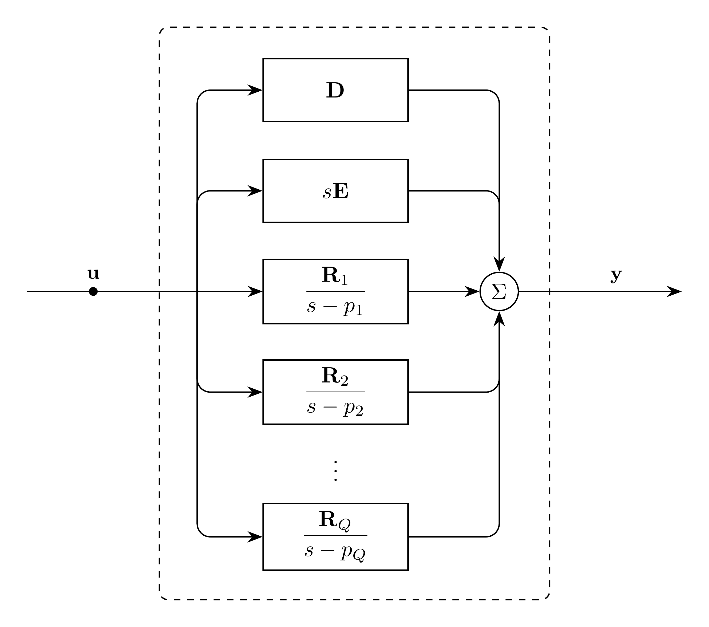

# VectorFit Model

`VectorFit` represents a vector-fitted matrix rational approximation with
complex poles and residues.

The rational approximation is represented in pole form:

```math
\mathbf{H}(s) \approx \mathbf{D} + s\mathbf{E}
  + \sum_{q=1}^{Q} \frac{\mathbf{R}_q}{s - p_q}
```

The Laplace domain representation of this model is:
```math
\mathbf{Y}(s) = \mathbf{H}(s)\mathbf{U}(s)
```

The time domain representation of this model is:
```math
\mathbf{y}(t) = (\mathbf{h}*\mathbf{u})(t)
```

## Block Diagram



Figure 1: VectorFit model

## Model Parameters

For output dimension $N$, input dimension $K$, and pole count $Q$:

Symbol | Units | JSON | Description | Note
------ | ----- | ---- | ----------- | ----
$\mathbf{D}$ | [-] | `D` | Constant coefficient | $\mathbf{D}\in\mathbb{R}^{N\times K}$
$\mathbf{E}$ | [s] | `E` | Linear coefficient | $\mathbf{E}\in\mathbb{R}^{N\times K}$
$\mathbf{p}$ | [1/s] | `poles` | Poles | $p_q=a_q+j\omega_q$, stored as `[a_q, omega_q]`
$\mathbf{A}$ | [1/s] | `A` | Real residue coefficients | $\mathbf{A}\in\mathbb{R}^{N\times K\times Q}$
$\mathbf{B}$ | [1/s] | `B` | Imaginary residue coefficients | $\mathbf{B}\in\mathbb{R}^{N\times K\times Q}$

### Parameter Validation

Each pole entry must satisfy:

```math
a_q^2 + \omega_q^2 \ne 0
```

### Model Derived Parameters

```math
\begin{aligned}
a_q &= \text{Re}(p_q) \\
\omega_q &= \text{Im}(p_q)
\end{aligned}
```

## Model Variables

### Internal Variables

#### Differential

Symbol | Units | Description | Note
------ | ----- | ----------- | ----
$\mathbf{w}_q$ | [-] | Real memory states | $\mathbf{w}_q\in\mathbb{R}^K$
$\mathbf{v}_q$ | [-] | Imaginary memory states | $\mathbf{v}_q\in\mathbb{R}^K$

#### Algebraic

Symbol | Units | Description | Note
------ | ----- | ----------- | ----
$\mathbf{y}_\text{out}$ | [-] | Output variables | $\mathbf{y}_\text{out}\in\mathbb{R}^N$

### External Variables

#### Differential

Symbol | Units | Description | Note
------ | ----- | ----------- | ----
$\mathbf{u}$ | [-] | Input vector | $\mathbf{u} \in \mathbb{R}^K$

#### Algebraic

None.

## Model Ports

Symbol | Port | Type | Units | Description | Note
------ | ---- | ---- | ----- | ----------- | ----
$\mathbf{u}$ | `input` | Input | [-] | Input vector port | $\mathbf{u} \in \mathbb{R}^K$
$\mathbf{y}_\text{out}$ | `out` | Output | [-] | Output contribution port | $\mathbf{y}_\text{out} \in \mathbb{R}^N$

## Model Equations

### Differential Equations

```math
\begin{aligned}
0 &= -\dot{\mathbf{w}}_q
     + a_q\mathbf{w}_q
     - \omega_q\mathbf{v}_q
     + \mathbf{u} \\
0 &= -\dot{\mathbf{v}}_q
     + \omega_q\mathbf{w}_q
     + a_q\mathbf{v}_q
\end{aligned}
```

### Algebraic Equations

```math
0 =
\mathbf{y}_\text{out}
-
\mathbf{D}\mathbf{u}
-
\mathbf{E}\dot{\mathbf{u}}
-
\sum_{q=1}^{Q}
\left(
  \mathbf{A}_q\mathbf{w}_q
  -
  \mathbf{B}_q\mathbf{v}_q
\right)
```

## Initialization

For an affine initial input trajectory, let subscript $0$ denote initial values:

```math
\begin{aligned}
\mathbf{w}_{q,0} &= -\frac{a_q}{a_q^2 + \omega_q^2}\mathbf{u}_0 - \frac{a_q^2 - \omega_q^2}{(a_q^2 + \omega_q^2)^2}\dot{\mathbf{u}}_0 \\
\mathbf{v}_{q,0} &= \frac{\omega_q}{a_q^2 + \omega_q^2}\mathbf{u}_0 + \frac{2a_q\omega_q}{(a_q^2 + \omega_q^2)^2}\dot{\mathbf{u}}_0 \\
\mathbf{y}_{\text{out},0} &= \mathbf{D}\mathbf{u}_0 + \mathbf{E}\dot{\mathbf{u}}_0 + \sum_{q=1}^{Q}\left(\mathbf{A}_q\mathbf{w}_{q,0} - \mathbf{B}_q\mathbf{v}_{q,0}\right)
\end{aligned}
```

## Monitors

None.
