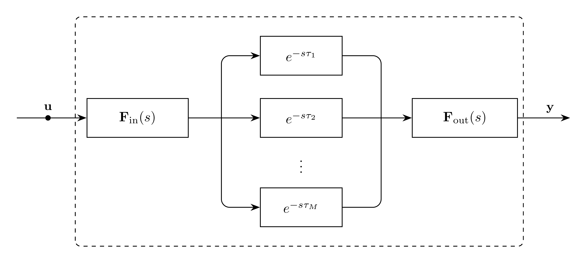

# Propagation Model

`Propagation` represents the current-form EMT propagation operator used by
`LineDistributed`. It composes two fitted `StateSpace` factors with one scalar
`Delay` block per propagation mode.

```math
\mathbf{H}_i(s)
=
\mathbf{F}_{\mathrm{out}}(s)
\boldsymbol{\Delta}_{\tau}(s)
\mathbf{F}_{\mathrm{in}}(s)
```

where

```math
\begin{aligned}
\mathbf{F}_{\mathrm{in}}(s) &\approx
\widehat{\mathbf{H}}^{\mathrm{mps}}(s)\mathbf{T}_v(s)^{\mathsf H} \\
\boldsymbol{\Delta}_{\tau}(s) &=
\operatorname{diag}\left(e^{-s\tau_1},\ldots,e^{-s\tau_M}\right) \\
\mathbf{F}_{\mathrm{out}}(s) &\approx
\mathbf{T}_i(s).
\end{aligned}
```

The state-space factors use the existing `StateSpace` form:

```math
\mathbf{F}_{r}(s)
\approx
\mathbf{D}_{r}
+ s\mathbf{E}_{r}
+ \mathbf{C}_{r}(s\mathbf{I}-\mathbf{P}_{r})^{-1}\mathbf{B}_{r},
\qquad
r \in \{\mathrm{in},\mathrm{out}\}.
```

The Laplace domain representation of this model is:

```math
\mathbf{Y}(s)=\mathbf{H}_i(s)\mathbf{U}(s)
```

The time domain representation of this model is:

```math
\mathbf{y}(t)=(\mathbf{h}_i*\mathbf{u})(t)
```

## Block Diagram

<div align="center">
   

  Figure 1: Propagation model
</div>

## Model Parameters

For conductor count $K$ and modal count $M$:

Symbol | Units | JSON | Description | Note
------ | ----- | ---- | ----------- | ----
$\mathbf{F}_{\mathrm{in}}$ | [-] | `input` | Input-side fitted factor | `StateSpace`, $M \times K$
$\boldsymbol{\tau}$ | [s] | `tau` | Modal propagation delays | $\boldsymbol{\tau}\in\mathbb{R}^M$
$\Delta t_{\min}$ | [s] | `dt_min` | Delay block resolution | passed to each scalar `Delay`
$\mathbf{F}_{\mathrm{out}}$ | [-] | `output` | Output-side fitted factor | `StateSpace`, $K \times M$

### Parameter Validation

```math
\begin{aligned}
\mathbf{F}_{\mathrm{in}} &: M \times K \\
\boldsymbol{\tau} &\in \mathbb{R}^M \\
\mathbf{F}_{\mathrm{out}} &: K \times M \\
\tau_m &> 0,\qquad m=1,\ldots,M \\
\Delta t_{\min} &> 0
\end{aligned}
```

The `StateSpace` child models validate their own poles and factor matrices.

### Model Derived Parameters

None. The child `StateSpace` and `Delay` models own their derived parameters.

### Model Submodels

Submodel | Inputs | Outputs
-------- | ------ | -------
[`StateSpace`](../../Rational/StateSpace/README.md) $\mathbf{F}_{\mathrm{in}}$ | $\mathbf{u}\in\mathbb{R}^K$ | $\mathbf{u}_{\mathrm{mod}}\in\mathbb{R}^M$
[`Delay`](../Delay/README.md) $\delta_m$, $m=1,\ldots,M$ | $u_{\mathrm{mod},m}$, $\tau_m$ | $d_{m,\mathrm{out}}$
[`StateSpace`](../../Rational/StateSpace/README.md) $\mathbf{F}_{\mathrm{out}}$ | $\mathbf{z}_{\mathrm{mod}}\in\mathbb{R}^M$ | $\mathbf{y}\in\mathbb{R}^K$

## Model Variables

### Internal Variables

#### Differential

None. The child `StateSpace` and `Delay` models own their differential states.

#### Algebraic

The child `StateSpace` and `Delay` models own their algebraic outputs.
`Propagation` owns only the temporary gather state needed to provide a
contiguous modal input to the output-side `StateSpace`.
The matching derivative storage `dot(z_mod)` is not a separate model variable
and is not tagged differential. It is initialized from the derivative storage
of the scalar `Delay` outputs so the output-side `StateSpace` can read a
consistent input derivative when $\mathbf{E}_{\mathrm{out}}$ is nonzero.

Symbol | Units | Description | Note
------ | ----- | ----------- | ----
$\mathbf{z}_{\mathrm{mod}}$ | [-] | Contiguous delayed modal signal | $\mathbf{z}_{\mathrm{mod}}\in\mathbb{R}^M$, temporary wrapper-owned algebraic state

### External Variables

#### Differential

Symbol | Units | Description | Note
------ | ----- | ----------- | ----
$\mathbf{u}$ | [-] | Input vector | $\mathbf{u}\in\mathbb{R}^K$

#### Algebraic

None.

## Model Ports

Symbol | Port | Type | Units | Description | Note
------ | ---- | ---- | ----- | ----------- | ----
$\mathbf{u}$ | `input` | Input | [-] | Input vector port | $\mathbf{u}\in\mathbb{R}^K$
$\mathbf{y}$ | `out` | Output | [-] | Output contribution port | $\mathbf{y}\in\mathbb{R}^K$

## Model Equations

### Differential Equations

None. The child `StateSpace` and `Delay` models own their differential equations.

### Algebraic Equations

The current `Signal` contract requires the output-side `StateSpace` input to be
a contiguous vector. Until EMT supports strided or gathered signals, the wrapper
owns a temporary algebraic gather state $\mathbf{z}_{\mathrm{mod}}$:

```math
0
= -z_{\mathrm{mod},m}
  + d_{m,\mathrm{out}},
\qquad m=1,\ldots,M.
```

Here $d_{m,\mathrm{out}}$ denotes the `out` port of the $m$th scalar `Delay`
child. This temporary state should be removed once the output-side `StateSpace`
can read the scalar `Delay` outputs directly.

### Port Equations

```math
\begin{aligned}
\mathbf{u}_{\mathrm{mod}} &= \mathbf{f}_{\mathrm{in}} * \mathbf{u} \\
d_{m,\mathrm{out}} &= \delta(t-\tau_m) * u_{\mathrm{mod},m},
  \qquad m=1,\ldots,M \\
\mathbf{y} &= \mathbf{f}_{\mathrm{out}} * \mathbf{z}_{\mathrm{mod}}.
\end{aligned}
```

## Initialization

Initialization is delegated to the child `StateSpace` and `Delay` models. The
wrapper initializes internal signals with the same interconnection equations:

```math
\begin{aligned}
\mathbf{u}_{\mathrm{mod},0} &= (\mathbf{f}_{\mathrm{in}} * \mathbf{u})_0 \\
d_{m,\mathrm{out},0} &= u_{\mathrm{mod},m,0},\qquad m=1,\ldots,M \\
z_{\mathrm{mod},m,0} &= d_{m,\mathrm{out},0},\qquad m=1,\ldots,M \\
\dot{z}_{\mathrm{mod},m,0} &= \dot{d}_{m,\mathrm{out},0},\qquad m=1,\ldots,M \\
\mathbf{y}_0 &= (\mathbf{f}_{\mathrm{out}} * \mathbf{z}_{\mathrm{mod}})_0.
\end{aligned}
```

## Monitors

None.
