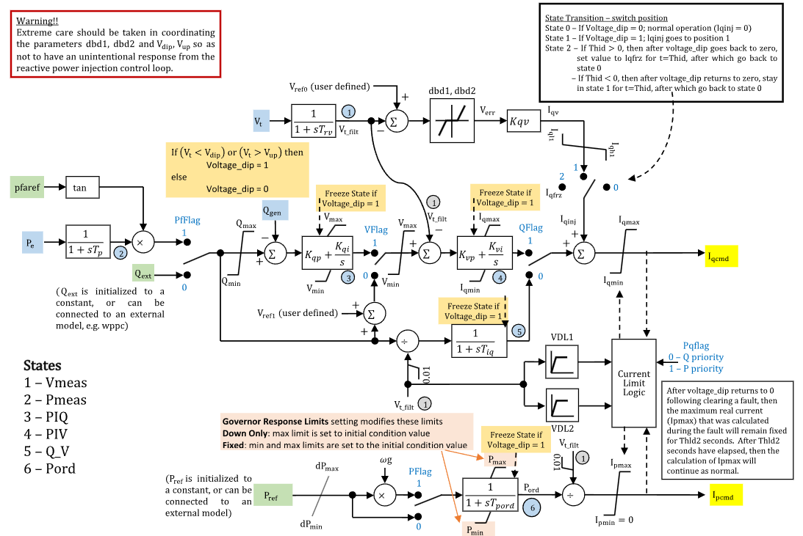

# **Renewable Energy Electrical Control Model (REECA)**

REECA is a WECC renewable energy electrical control model for inverter-coupled resources. In GridKit it is represented as a signal-control model that computes active- and reactive-current commands.

Notes:
- Internal electrical quantities and current commands are on model base unless otherwise stated.
- `pe`/`qgen` electrical signal ports are on system base and are converted to
  REECA model base through `mva`. When driven by a plant controller, `mva`
  should equal the plant-controller base so model-base command signals agree.
- The `pe` and `qgen` signal ports must be connected together. If both are
  omitted, initialization recovers the constant electrical feedback from the
  model-base `ipcmd` and `iqcmd` signals.
- `qext`, `pref`, `iqcmd`, and `ipcmd` are model-base command signals.
- Optional signal inputs default to their initialized constant values when omitted.
- Timer-based post-dip reactive-current injection hold and active-current limit hold are not modeled in this version; $T_{\mathrm{hld}}$ and $T_{\mathrm{hld2}}$ must be zero, and $I_{\mathrm{qinj}}^{\mathrm{frz}}$ is unreachable.

## Block Diagram

Standard REECA block diagram.



Figure 1: REECA block diagram. Figure courtesy of [PowerWorld](https://www.powerworld.com/WebHelp/)

## Model Parameters

Symbol                              | Units    | JSON     | Description                                             | Typical Value | Note
------------------------------------|----------|----------|---------------------------------------------------------|---------------|------
$S^{\mathrm{base}}$                 | [MVA]    | `mva`    | REECA model power base                                  | 100.0         | Block name: `MVABase`
$s_{\mathrm{pf}}$                   | [binary] | `PfFlag` | Power-factor control flag                               | 0             | Block name: `PfFlag`; 1 = power-factor control, 0 = Q control
$s_V$                               | [binary] | `VFlag`  | Voltage-control mode flag                               | 0             | Block name: `VFlag`; 1 = Q control, 0 = voltage control
$s_Q$                               | [binary] | `QFlag`  | Reactive-power control flag                             | 0             | Block name: `QFlag`; 1 = voltage/Q control, 0 = constant pf or Q control
$s_P$                               | [binary] | `PFlag`  | Active-power reference speed-multiplier flag            | 0             | Block name: `PFlag`; 1 = multiply by generator speed
$s_{PQ}$                            | [binary] | `Pqflag` | P/Q priority flag for converter current limit           | 0             | Block name: `Pqflag`; 0 = Q priority, 1 = P priority
$T_{\mathrm{rv}}$                   | [sec]    | `Trv`    | Voltage-measurement filter time constant                | 0.02          | Block name: `Trv`; if zero, $V_{\mathrm{meas}}$ is algebraic
$T_{\mathrm{p}}$                    | [sec]    | `Tp`     | Electrical-power measurement filter time constant       | 0.0           | Block name: `Tp`; if zero, $P_{\mathrm{meas}}$ is algebraic
$V_{\mathrm{ref0}}$                 | [p.u.]   | `Vref0`  | Outer-loop voltage reference                            | 0.0           | Block name: `Vref0`; initialized to terminal voltage if omitted
$V_{\mathrm{dip}}$                  | [p.u.]   | `Vdip`   | Low-voltage threshold for reactive-current injection logic | 0.85       | Block name: `Vdip`
$V_{\mathrm{up}}$                   | [p.u.]   | `Vup`    | High-voltage threshold for reactive-current injection logic | 1.15      | Block name: `Vup`
$D_{\mathrm{bd1}}$                  | [p.u.]   | `dbd1`   | Overvoltage deadband for voltage-error response         | 0.0           | Block name: `dbd1`
$D_{\mathrm{bd2}}$                  | [p.u.]   | `dbd2`   | Undervoltage deadband for voltage-error response        | 0.0           | Block name: `dbd2`
$K_{\mathrm{qv}}$                   | [p.u.]   | `kqv`    | Reactive-current injection gain during voltage dip/overvoltage logic | 5.0 | Block name: `kqv`
$I_{\mathrm{qinj}}^{\min}$          | [p.u.]   | `Iql1`   | Minimum reactive-current injection limit                | -1.1          | Block name: `Iql1`
$I_{\mathrm{qinj}}^{\max}$          | [p.u.]   | `Iqh1`   | Maximum reactive-current injection limit                | 1.1           | Block name: `Iqh1`
$I_{\mathrm{qinj}}^{\mathrm{frz}}$  | [p.u.]   | `Iqfrz`  | Held reactive-current injection value after voltage dip | 0.0           | Block name: `Iqfrz`; unused when $T_{\mathrm{hld}} = 0$
$T_{\mathrm{hld}}$                  | [sec]    | `Thld`   | Reactive-current injection hold time after voltage dip clears | 0.0      | Block name: `Thld`; required to be zero in this version
$T_{\mathrm{hld2}}$                 | [sec]    | `Thld2`  | Active-current limit hold time after voltage dip clears | 0.0           | Block name: `Thld2`; optional, required to be zero in this version
$Q^{\max}$                          | [p.u.]   | `Qmax`   | Maximum reactive-power control limit                    | 0.436         | Block name: `Qmax`
$Q^{\min}$                          | [p.u.]   | `Qmin`   | Minimum reactive-power control limit                    | -0.436        | Block name: `Qmin`
$K_{\mathrm{qp}}$                   | [p.u.]   | `Kqp`    | Reactive-power control proportional gain                | 0.0           | Block name: `Kqp`
$K_{\mathrm{qi}}$                   | [p.u./s] | `Kqi`    | Reactive-power control integral gain                    | 0.1           | Block name: `Kqi`
$V^{\max}$                          | [p.u.]   | `Vmax`   | Maximum voltage-control limit                           | 1.1           | Block name: `Vmax`
$V^{\min}$                          | [p.u.]   | `Vmin`   | Minimum voltage-control limit                           | 0.9           | Block name: `Vmin`
$V_{\mathrm{ref1}}$                 | [p.u.]   | `Vref1`  | Inner-loop voltage-control reference/bias               | 0.0           | Block name: `Vref1`
$K_{\mathrm{vp}}$                   | [p.u.]   | `Kvp`    | Voltage-control proportional gain                       | 18.0          | Block name: `Kvp`
$K_{\mathrm{vi}}$                   | [p.u./s] | `Kvi`    | Voltage-control integral gain                           | 5.0           | Block name: `Kvi`
$T_{\mathrm{iq}}$                   | [sec]    | `Tiq`    | Reactive-current command lag time constant              | 0.02          | Block name: `Tiq`
$T_{\mathrm{pord}}$                 | [sec]    | `Tpord`  | Active-power order filter time constant                 | 0.02          | Block name: `Tpord`
$R_P^{\max}$                        | [p.u./s] | `dPmax`  | Positive active-power order ramp-rate limit             | 99.0          | Block name: `dPmax`
$R_P^{\min}$                        | [p.u./s] | `dPmin`  | Negative active-power order ramp-rate limit             | -99.0         | Block name: `dPmin`
$P^{\max}$                          | [p.u.]   | `Pmax`   | Maximum active-power order limit                        | 1.0           | Block name: `Pmax`
$P^{\min}$                          | [p.u.]   | `Pmin`   | Minimum active-power order limit                        | 0.0           | Block name: `Pmin`
$I^{\max}$                          | [p.u.]   | `Imax`   | Maximum total converter current                         | 1.3           | Block name: `Imax`
$V_{\mathrm{q},1}$                  | [p.u.]   | `Vq1`    | VDL1 voltage point 1                                    | 0.2           | VDL1 in Fig. 1
$I_{\mathrm{q},1}^{\max}$           | [p.u.]   | `Iq1`    | VDL1 reactive-current limit point 1                     | 1.3           | VDL1 in Fig. 1
$V_{\mathrm{q},2}$                  | [p.u.]   | `Vq2`    | VDL1 voltage point 2                                    | 0.5           | VDL1 in Fig. 1
$I_{\mathrm{q},2}^{\max}$           | [p.u.]   | `Iq2`    | VDL1 reactive-current limit point 2                     | 1.3           | VDL1 in Fig. 1
$V_{\mathrm{q},3}$                  | [p.u.]   | `Vq3`    | VDL1 voltage point 3                                    | 0.75          | VDL1 in Fig. 1
$I_{\mathrm{q},3}^{\max}$           | [p.u.]   | `Iq3`    | VDL1 reactive-current limit point 3                     | 1.3           | VDL1 in Fig. 1
$V_{\mathrm{q},4}$                  | [p.u.]   | `Vq4`    | VDL1 voltage point 4                                    | 1.0           | VDL1 in Fig. 1
$I_{\mathrm{q},4}^{\max}$           | [p.u.]   | `Iq4`    | VDL1 reactive-current limit point 4                     | 1.3           | VDL1 in Fig. 1
$V_{\mathrm{p},1}$                  | [p.u.]   | `Vp1`    | VDL2 voltage point 1                                    | 0.2           | VDL2 in Fig. 1
$I_{\mathrm{p},1}^{\max}$           | [p.u.]   | `Ip1`    | VDL2 active-current limit point 1                       | 1.3           | VDL2 in Fig. 1
$V_{\mathrm{p},2}$                  | [p.u.]   | `Vp2`    | VDL2 voltage point 2                                    | 0.5           | VDL2 in Fig. 1
$I_{\mathrm{p},2}^{\max}$           | [p.u.]   | `Ip2`    | VDL2 active-current limit point 2                       | 1.3           | VDL2 in Fig. 1
$V_{\mathrm{p},3}$                  | [p.u.]   | `Vp3`    | VDL2 voltage point 3                                    | 0.75          | VDL2 in Fig. 1
$I_{\mathrm{p},3}^{\max}$           | [p.u.]   | `Ip3`    | VDL2 active-current limit point 3                       | 1.3           | VDL2 in Fig. 1
$V_{\mathrm{p},4}$                  | [p.u.]   | `Vp4`    | VDL2 voltage point 4                                    | 1.0           | VDL2 in Fig. 1
$I_{\mathrm{p},4}^{\max}$           | [p.u.]   | `Ip4`    | VDL2 active-current limit point 4                       | 1.3           | VDL2 in Fig. 1

### Parameter Validation

Implementations should reject invalid REECA parameter sets. If source data preprocessing adjusts active-power ramp-rate or order limits, apply these checks to the effective values used by the equations.

The required checks are:

```math
\begin{aligned}
  &S^{\mathrm{base}} > 0 \\
  &s_{\mathrm{pf}}, s_V, s_Q, s_P, s_{PQ} \in \{0,1\} \\
  &T_{\mathrm{rv}}, T_{\mathrm{p}} \ge 0 \\
  &0 \le V_{\mathrm{dip}} < V_{\mathrm{up}} \\
  &D_{\mathrm{bd1}} \le 0 \le D_{\mathrm{bd2}} \\
  &I_{\mathrm{qinj}}^{\min} \le I_{\mathrm{qinj}}^{\max} \\
  &T_{\mathrm{hld}} = T_{\mathrm{hld2}} = 0 \\
  &Q^{\min} \le Q^{\max} \\
  &V^{\min} \le V^{\max} \\
  &T_{\mathrm{iq}}, T_{\mathrm{pord}} > 0 \\
  &R_P^{\min} < 0 < R_P^{\max} \\
  &P^{\min} \le P^{\max} \\
  &I^{\max} \ge 0 \\
  &0 \le V_{\mathrm{q},1} < V_{\mathrm{q},2} < V_{\mathrm{q},3} < V_{\mathrm{q},4} \\
  &I_{\mathrm{q},k}^{\max} \ge 0\ \text{for } k=1,\ldots,4 \\
  &0 \le V_{\mathrm{p},1} < V_{\mathrm{p},2} < V_{\mathrm{p},3} < V_{\mathrm{p},4} \\
  &I_{\mathrm{p},k}^{\max} \ge 0\ \text{for } k=1,\ldots,4
\end{aligned}
```

### Model Derived Parameters

The off-mode flag complements are:

```math
\begin{aligned}
  s_{\mathrm{pf}}^{\mathrm{off}} &= 1 - s_{\mathrm{pf}} \\
  s_V^{\mathrm{off}} &= 1 - s_V \\
  s_Q^{\mathrm{off}} &= 1 - s_Q \\
  s_{PQ}^{\mathrm{off}} &= 1 - s_{PQ}
\end{aligned}
```

The VDL functions use GridKit's smooth [Linear Segment](../../../../CommonMath.md#derived-functions) helper and provide flat extrapolation outside the first and fourth voltage points:

```math
\begin{aligned}
  g_q(x) &=
    I_{\mathrm{q},1}^{\max}
    + \sum_{k=1}^{3}
      \text{linseg}\!\left(
        x;\,
        V_{\mathrm{q},k},\,
        V_{\mathrm{q},k+1},\,
        I_{\mathrm{q},k+1}^{\max} - I_{\mathrm{q},k}^{\max}
      \right) \\
  g_p(x) &=
    I_{\mathrm{p},1}^{\max}
    + \sum_{k=1}^{3}
      \text{linseg}\!\left(
        x;\,
        V_{\mathrm{p},k},\,
        V_{\mathrm{p},k+1},\,
        I_{\mathrm{p},k+1}^{\max} - I_{\mathrm{p},k}^{\max}
      \right)
\end{aligned}
```

## Model Variables

### Internal Variables

#### Differential

Symbol                  | Units  | Description                         | Note
------------------------|--------|-------------------------------------|------
$V_{\mathrm{meas}}$     | [p.u.] | Filtered terminal voltage           | State 1 in Fig. 1; source label: `Vmeas`; algebraic when $T_{\mathrm{rv}} = 0$
$P_{\mathrm{meas}}$     | [p.u.] | Filtered electrical power           | State 2 in Fig. 1; source label: `Pmeas`; algebraic when $T_{\mathrm{p}} = 0$
$x_{\mathrm{PIQ}}$      | [p.u.] | Reactive-power PI controller state  | State 3 in Fig. 1; source label: `PIQ`
$x_{\mathrm{PIV}}$      | [p.u.] | Voltage PI controller state         | State 4 in Fig. 1; source label: `PIV`
$Q_V$                   | [p.u.] | Reactive-current command lag state  | State 5 in Fig. 1; source label: `Q_V`
$P_{\mathrm{ord}}$      | [p.u.] | Filtered active-power order         | State 6 in Fig. 1; source label: `Pord`

#### Algebraic

Symbol                          | Units  | Description                         | Note
--------------------------------|--------|-------------------------------------|------
$V_T$                           | [p.u.] | Terminal voltage magnitude          |
$V_{\mathrm{meas}}^{\mathrm{safe}}$ | [p.u.] | Safe filtered terminal voltage for divider blocks | Lower bounded by 0.01
$s_{\mathrm{dip}}$              | [binary] | Voltage-dip/overvoltage freeze indicator | 1 when outside voltage thresholds
$V_{\mathrm{err}}$              | [p.u.] | Deadbanded voltage error            | Defined by CommonMath `deadband2`
$I_{\mathrm{qv}}$               | [p.u.] | Reactive-current injection candidate | Converter base
$Q_{\mathrm{ref}}$              | [p.u.] | Selected reactive-power reference   | From power-factor or external reactive-power command
$e_Q$                           | [p.u.] | Reactive-power control error        | Limited $Q_{\mathrm{ref}}$ minus $Q_{\mathrm{gen}}$
$V_{\mathrm{PIQ}}$              | [p.u.] | Reactive-power control PI output    | Limited by $V^{\min}$ and $V^{\max}$
$e_{\mathrm{PIV}}$              | [p.u.] | Voltage-control PI error            | Selected voltage-control signal minus $V_{\mathrm{meas}}$
$f_{\mathrm{pord}}$             | [p.u./s] | Active-power order derivative before ramp-rate limiting | Feeds $r_{\mathrm{pord}}$
$r_{\mathrm{pord}}$             | [p.u./s] | Ramp-rate-limited active-power order derivative | Feeds $P_{\mathrm{ord}}$ anti-windup
$I_{\mathrm{q}}^{\mathrm{circ}}$ | [p.u.] | Reactive-current limit from converter current circle | Converter base; nonnegative algebraic branch
$I_{\mathrm{p}}^{\mathrm{circ}}$ | [p.u.] | Active-current limit from converter current circle | Converter base; nonnegative algebraic branch
$I_{\mathrm{q}}^{\max}$         | [p.u.] | Final reactive-current upper limit  | Converter base; updated by VDL1 and current-limit logic
$I_{\mathrm{p}}^{\max}$         | [p.u.] | Final active-current upper limit    | Converter base; updated by VDL2 and current-limit logic
$I_{\mathrm{qbase}}$            | [p.u.] | Base reactive-current command       | Converter base; before $s_Q$ selection and reactive-current injection
$I_{\mathrm{q}}^{\mathrm{raw}}$ | [p.u.] | Raw reactive-current command before final limit | Converter base
$I_{\mathrm{q}}^{\mathrm{cmd}}$ | [p.u.] | Reactive-current command output     | Converter base
$I_{\mathrm{p}}^{\mathrm{cmd}}$ | [p.u.] | Active-current command output       | Converter base

### External Variables

#### Differential

Symbol     | Units  | Description             | Note
-----------|--------|-------------------------|------
$\omega$   | [p.u.] | Generator speed deviation | Optional, defaults to zero; source diagram $\omega_g = 1 + \omega$

#### Algebraic

Symbol                               | Units  | Description                       | Note
-------------------------------------|--------|-----------------------------------|------
$V_{\mathrm{r}}$                     | [p.u.] | Terminal voltage, real component  | Owned by bus object
$V_{\mathrm{i}}$                     | [p.u.] | Terminal voltage, imaginary component | Owned by bus object
$P_e$                                | [p.u.] | Electrical active power           | Source label: `Pe`; system-base signal converted to model base
$Q_{\mathrm{gen}}$                   | [p.u.] | Reactive-power feedback           | Source label: `Qgen`; system-base signal converted to model base
$Q_{\mathrm{ext}}$                   | [p.u.] | External reactive-power command   | Model-base command; optional, defaults to initialized constant
$\phi_{\mathrm{pf}}^{\mathrm{ref}}$  | [rad]  | Power-factor angle reference      | Source label: `pfaref`; used through tangent block
$P_{\mathrm{ref}}$                   | [p.u.] | External active-power reference   | Model-base command; optional, defaults to initialized constant

## Model Equations

For readability, define:

```math
\begin{aligned}
  f_{\mathrm{PIQ}} &= K_{\mathrm{qi}} e_Q \\
  f_{\mathrm{PIV}} &= K_{\mathrm{vi}} e_{\mathrm{PIV}}
\end{aligned}
```

### Differential Equations

The state-equation residuals use compact limiter notation where applicable. The measurement filters are written in descriptor form: if $T_{\mathrm{rv}} = 0$ or $T_{\mathrm{p}} = 0$, the corresponding variable should be tagged algebraic. The $Q_V$ equation also uses $T_{\mathrm{iq}}$ as a derivative coefficient, but $T_{\mathrm{iq}} > 0$ remains required because the freeze multiplier makes the zero-time case structurally different.

```math
\begin{aligned}
  0 &= -T_{\mathrm{rv}}\dot V_{\mathrm{meas}} - V_{\mathrm{meas}} + V_T \\
  0 &= -T_{\mathrm{p}}\dot P_{\mathrm{meas}} - P_{\mathrm{meas}} + P_e \\
  0 &=
    -\dot x_{\mathrm{PIQ}}
    + (1 - s_{\mathrm{dip}})
    \text{antiwindup}\!\left(
      V_{\mathrm{PIQ}},
      f_{\mathrm{PIQ}},
      V^{\min},
      V^{\max}
    \right) \\
  0 &=
    -\dot x_{\mathrm{PIV}}
    + (1 - s_{\mathrm{dip}})
    \text{antiwindup}\!\left(
      I_{\mathrm{qbase}},
      f_{\mathrm{PIV}},
      -I_{\mathrm{q}}^{\max},
      I_{\mathrm{q}}^{\max}
    \right) \\
  0 &=
    -T_{\mathrm{iq}}\dot Q_V
    - (1 - s_{\mathrm{dip}})Q_V
    + (1 - s_{\mathrm{dip}})Q_{\mathrm{ref}}/V_{\mathrm{meas}}^{\mathrm{safe}} \\
  0 &=
    -\dot P_{\mathrm{ord}}
    + (1 - s_{\mathrm{dip}})
    \text{antiwindup}\!\left(
      P_{\mathrm{ord}},
      r_{\mathrm{pord}},
      P^{\min},
      P^{\max}
    \right)
\end{aligned}
```

CommonMath defines the [Anti-Windup](../../../../CommonMath.md#antiwindup) target and smooth approximation.

### Algebraic Equations

The algebraic targets use CommonMath helper notation where applicable:

```math
\begin{aligned}
  0 &= -V_T^2 + V_\mathrm r^2 + V_\mathrm i^2 \\
  0 &= -V_\mathrm{meas}^\mathrm{safe} + \max(V_\mathrm{meas}, 0.01) \\
  0 &= -s_\mathrm{dip} + \text{outside}(V_T, V_\mathrm{dip}, V_\mathrm{up}) \\
  0 &= -V_\mathrm{err} + \text{deadband2}(V_\mathrm{ref0} - V_\mathrm{meas}, D_\mathrm{bd1}, D_\mathrm{bd2}) \\
  0 &= -I_\mathrm{qv} + \text{clamp}(K_\mathrm{qv} V_\mathrm{err}, I_\mathrm{qinj}^{\min}, I_\mathrm{qinj}^{\max}) \\
  0 &= -Q_\mathrm{ref}
       + s_\mathrm{pf} P_\mathrm{meas}\tan(\phi_\mathrm{pf}^\mathrm{ref})
       + s_\mathrm{pf}^\mathrm{off} Q_\mathrm{ext} \\
  0 &= -e_Q + \text{clamp}(Q_\mathrm{ref}, Q^{\min}, Q^{\max}) - Q_\mathrm{gen} \\
  0 &= -V_\mathrm{PIQ} + \text{clamp}(K_\mathrm{qp} e_Q + x_\mathrm{PIQ}, V^{\min}, V^{\max}) \\
  0 &= -e_\mathrm{PIV} + s_V V_\mathrm{PIQ} + s_V^\mathrm{off}(Q_\mathrm{ref} + V_\mathrm{ref1}) - V_\mathrm{meas} \\
  0 &= -T_\mathrm{pord} f_\mathrm{pord} + (1 + s_P\omega)P_\mathrm{ref} - P_\mathrm{ord} \\
  0 &= -r_\mathrm{pord} + \text{clamp}(f_\mathrm{pord}, R_P^{\min}, R_P^{\max})
\end{aligned}
```

```math
\begin{aligned}
  0 &= -{I_\mathrm{q}^\mathrm{circ}}^2 + (I^{\max})^2 - s_{PQ}(I_\mathrm{p}^\mathrm{cmd})^2 \\
  0 &= -{I_\mathrm{p}^\mathrm{circ}}^2 + (I^{\max})^2 - s_{PQ}^\mathrm{off}(I_\mathrm{q}^\mathrm{cmd})^2 \\
  0 &= -I_\mathrm{q}^{\max} + \text{min}(g_q(V_\mathrm{meas}), I_\mathrm{q}^\mathrm{circ}) \\
  0 &= -I_\mathrm{p}^{\max} + \text{min}(g_p(V_\mathrm{meas}), I_\mathrm{p}^\mathrm{circ}) \\
  0 &= -I_\mathrm{qbase} + \text{clamp}(K_\mathrm{vp} e_\mathrm{PIV} + x_\mathrm{PIV}, -I_\mathrm{q}^{\max}, I_\mathrm{q}^{\max}) \\
  0 &= -I_\mathrm{q}^\mathrm{raw} + s_Q I_\mathrm{qbase} + s_Q^\mathrm{off} Q_V + s_\mathrm{dip} I_\mathrm{qv} \\
  0 &= -I_\mathrm{q}^\mathrm{cmd} + \text{clamp}(I_\mathrm{q}^\mathrm{raw}, -I_\mathrm{q}^{\max}, I_\mathrm{q}^{\max}) \\
  0 &= -I_\mathrm{p}^\mathrm{cmd} + \text{clamp}(P_\mathrm{ord}/V_\mathrm{meas}^\mathrm{safe}, 0, I_\mathrm{p}^{\max})
\end{aligned}
```

The $V_T$, $I_{\mathrm{q}}^{\mathrm{circ}}$, and $I_{\mathrm{p}}^{\mathrm{circ}}$ variables use nonnegative branches of squared algebraic residuals. This preserves the $s_{PQ}=0$ Q-priority and $s_{PQ}=1$ P-priority current-circle behavior without explicit square roots; a consistent solution should satisfy the nonnegative branch and nonnegative radicands.

CommonMath defines the helper targets and smooth approximations for [min, max, clamp, deadband2, and outside](../../../../CommonMath.md#derived-functions).

## Initialization

Initialization is performed by evaluating the steady-state residuals in dependency order. Let subscript $0$ denote initial values and set all internal derivatives to zero. REECA recovers the initial electrical operating point from the model-base `ipcmd` and `iqcmd` signal values initialized upstream (for example by REGCA):

```math
\begin{aligned}
  V_{T,0} &= \sqrt{V_{\mathrm{r},0}^2 + V_{\mathrm{i},0}^2} \\
  P_{e,0} &= I_{\mathrm{p},0}^{\mathrm{cmd}}\, V_{\mathrm{meas},0}^{\mathrm{safe}} \\
  Q_{\mathrm{gen},0} &= I_{\mathrm{q},0}^{\mathrm{cmd}}\, V_{\mathrm{meas},0}^{\mathrm{safe}} \\
  \omega_0 &= 0\ \text{when the speed signal is omitted} \\
  Q_{\mathrm{ext},0} &= Q_{\mathrm{gen},0} \\
  P_{\mathrm{ref},0} &= \dfrac{P_{e,0}}{1+s_P\omega_0} \\
  \phi_{\mathrm{pf},0}^{\mathrm{ref}} &= \arctan\!\left(\dfrac{Q_{\mathrm{gen},0}}{P_{e,0}}\right)\ \text{(zero when}\ P_{e,0} = 0\text{)}
\end{aligned}
```

When the optional `qext`, `pfaref`, or `pref` signals are connected, initialization writes the recovered steady-state references to those signals so an upstream plant controller can seed from them. When the `pe`/`qgen` ports are connected, their sources must carry the matching system-base electrical feedback. A standard start requires $V_{\mathrm{dip}} < V_{T,0} < V_{\mathrm{up}}$, $Q_{\mathrm{ref},0}$ within $[Q^{\min}, Q^{\max}]$, and $P_{\mathrm{ord},0}$ within $[P^{\min}, P^{\max}]$.

If $V_{\mathrm{ref0}}$ is omitted, set $V_{\mathrm{ref0}} = V_{T,0}$. Initialize the measurement variables from the descriptor-form filter residuals:

```math
\begin{aligned}
  V_{\mathrm{meas},0} &= V_{T,0} \\
  P_{\mathrm{meas},0} &= P_{e,0}
\end{aligned}
```

When $T_{\mathrm{rv}} = 0$ or $T_{\mathrm{p}} = 0$, the corresponding relation is an algebraic residual rather than a differential-state initial condition.

Then evaluate the upstream algebraic chain:

```math
\begin{aligned}
  V_{\mathrm{meas},0}^{\mathrm{safe}} &= \text{max}(V_{\mathrm{meas},0}, 0.01) \\
  s_{\mathrm{dip},0} &= \text{outside}(V_{T,0}, V_{\mathrm{dip}}, V_{\mathrm{up}}) \\
  V_{\mathrm{err},0} &= \text{deadband2}(V_{\mathrm{ref0}} - V_{\mathrm{meas},0}, D_{\mathrm{bd1}}, D_{\mathrm{bd2}}) \\
  I_{\mathrm{qv},0} &= \text{clamp}(K_{\mathrm{qv}} V_{\mathrm{err},0}, I_{\mathrm{qinj}}^{\min}, I_{\mathrm{qinj}}^{\max}) \\
  Q_{\mathrm{ref},0} &= s_{\mathrm{pf}} P_{\mathrm{meas},0}\tan(\phi_{\mathrm{pf},0}^{\mathrm{ref}}) + s_{\mathrm{pf}}^{\mathrm{off}} Q_{\mathrm{ext},0} \\
  e_{Q,0} &= \text{clamp}(Q_{\mathrm{ref},0}, Q^{\min}, Q^{\max}) - Q_{\mathrm{gen},0} \\
  Q_{V,0} &= \dfrac{Q_{\mathrm{ref},0}}{V_{\mathrm{meas},0}^{\mathrm{safe}}} \\
  P_{\mathrm{ord},0} &= (1+s_P\omega_0)P_{\mathrm{ref},0}
\end{aligned}
```

Initialize the reactive-power PI output so its residual and zero-derivative anti-windup condition hold:

```math
\begin{aligned}
  V_{\mathrm{PIQ},0} &= \text{clamp}(K_{\mathrm{qp}} e_{Q,0} + x_{\mathrm{PIQ},0}, V^{\min}, V^{\max}) \\
  e_{\mathrm{PIV},0} &= s_V V_{\mathrm{PIQ},0} + s_V^{\mathrm{off}}(Q_{\mathrm{ref},0} + V_{\mathrm{ref1}}) - V_{\mathrm{meas},0}
\end{aligned}
```

For an unsaturated zero-derivative start, require $e_{Q,0}=0$ for $x_{\mathrm{PIQ}}$ and choose or verify $e_{\mathrm{PIV},0}=0$ for $x_{\mathrm{PIV}}$. Then $x_{\mathrm{PIQ},0}=V_{\mathrm{PIQ},0}-K_{\mathrm{qp}}e_{Q,0}$; when $s_V=1$, set $V_{\mathrm{PIQ},0}=V_{\mathrm{meas},0}$. When the PI error and integral rate are nonzero, initialization instead parks the PI output just outside the active limit so the anti-windup residuals hold in a saturation-consistent state.

Finish by evaluating $g_q(V_{\mathrm{meas},0})$, $g_p(V_{\mathrm{meas},0})$, and the current-limit and current-command algebraic residuals in priority order. At the command steps, use the power-flow current targets before final limiting:

```math
\begin{aligned}
  I_{\mathrm{qbase},0}^{\star} &= \dfrac{Q_{\mathrm{gen},0}}{V_{\mathrm{meas},0}^{\mathrm{safe}}} \\
  I_{\mathrm{p},0}^{\star} &= \dfrac{P_{\mathrm{ord},0}}{V_{\mathrm{meas},0}^{\mathrm{safe}}}
\end{aligned}
```

For $s_{PQ}=0$, use:

```math
\begin{aligned}
I_{\mathrm{q},0}^{\mathrm{circ}}
\rightarrow I_{\mathrm{q},0}^{\max}
\rightarrow I_{\mathrm{qbase},0}
\rightarrow I_{\mathrm{q},0}^{\mathrm{raw}}
\rightarrow I_{\mathrm{q},0}^{\mathrm{cmd}}
\rightarrow I_{\mathrm{p},0}^{\mathrm{circ}}
\rightarrow I_{\mathrm{p},0}^{\max}
\rightarrow I_{\mathrm{p},0}^{\mathrm{cmd}}
\end{aligned}
```

For $s_{PQ}=1$, use:

```math
\begin{aligned}
I_{\mathrm{p},0}^{\mathrm{circ}}
\rightarrow I_{\mathrm{p},0}^{\max}
\rightarrow I_{\mathrm{p},0}^{\mathrm{cmd}}
\rightarrow I_{\mathrm{q},0}^{\mathrm{circ}}
\rightarrow I_{\mathrm{q},0}^{\max}
\rightarrow I_{\mathrm{qbase},0}
\rightarrow I_{\mathrm{q},0}^{\mathrm{raw}}
\rightarrow I_{\mathrm{q},0}^{\mathrm{cmd}}
\end{aligned}
```

After $I_{\mathrm{q},0}^{\max}$ and $I_{\mathrm{qbase},0}$ are known, initialize the voltage PI state from its output residual; the unsaturated zero-derivative start also requires the $e_{\mathrm{PIV},0}=0$ condition above:

```math
x_{\mathrm{PIV},0} = I_{\mathrm{qbase},0} - K_{\mathrm{vp}} e_{\mathrm{PIV},0}
```

The current-circle variables use the nonnegative branch of the squared algebraic residuals; initialization must reject negative radicands. A standard steady-state initialization assumes $s_{\mathrm{dip},0}=0$. If initialized during voltage-dip or overvoltage logic, $Q_V$, $P_{\mathrm{ord}}$, and the PI histories are not uniquely determined without the unsupported hold-timer histories, so the implementation should solve a saturation-consistent state or reject the start.

## Model Outputs

Output          | Units  | Description                         | Note
----------------|--------|-------------------------------------|------
`iqcmd`         | [p.u.] | Reactive-current command output     | Converter base
`ipcmd`         | [p.u.] | Active-current command output       | Converter base
`vmeas`         | [p.u.] | Filtered terminal voltage           |
`pmeas`         | [p.u.] | Filtered electrical power           |
`piq`           | [p.u.] | Reactive-power PI controller state  |
`piv`           | [p.u.] | Voltage PI controller state         |
`qv`            | [p.u.] | Reactive-current command lag state  |
`pord`          | [p.u.] | Filtered active-power order         |
`qref`          | [p.u.] | Selected reactive-power reference   |
`sdip`          | [binary] | Voltage-dip/overvoltage freeze indicator |
`iqmax`         | [p.u.] | Final reactive-current upper limit  | Converter base
`ipmax`         | [p.u.] | Final active-current upper limit    | Converter base
`iqv`           | [p.u.] | Reactive-current injection candidate | Converter base
`vqctrl`        | [p.u.] | Reactive-power control PI output    |
`iqbase`        | [p.u.] | Base reactive-current command       | Converter base
