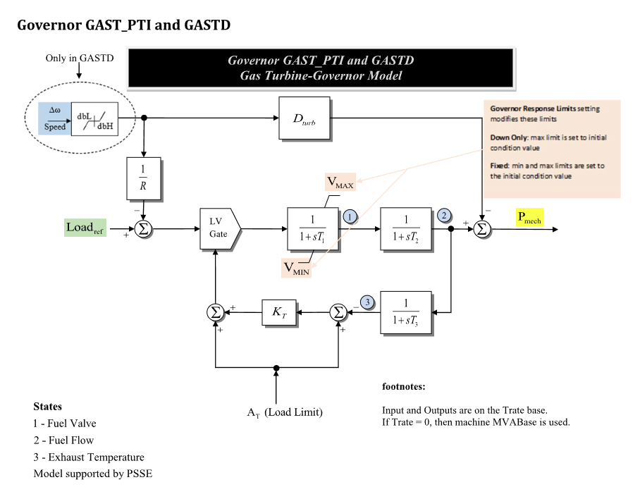

# **Gas Turbine-Governor Model (GASTPTI)**

GASTPTI is a gas turbine-governor model for thermal generating units. In
GridKit it is represented as a governor model that reads machine speed
deviation and supplies mechanical power to the machine through a fuel-valve,
fuel-flow, and exhaust-temperature limiting chain.

## Notes

- Power signal ports and the `pmech` monitor output are on system base.
- Internal fuel/load states and limiter quantities are on GASTPTI component base.
- GASTPTI uses $T^\mathrm{rate}$, loaded from `Trate`, as its component power base.
- All ten JSON parameters listed below are required.
- The diagram shows the GASTD speed deadband block (`dbL`/`dbH`). That block is
  only used by GASTD; GASTPTI uses $\omega$ directly.

## Block Diagram

Standard GASTPTI block diagram.



Figure 1: GASTPTI block diagram. Figure courtesy of [PowerWorld](https://www.powerworld.com/WebHelp/)

## Model Parameters

Symbol                          | Units    | JSON     | Description                                  | Typical Value | Note
--------------------------------|----------|----------|----------------------------------------------|---------------|------
$R$                             | [p.u.]   | `R`      | Permanent droop                              | 0.05          | Required positive value
$T_1$                           | [sec]    | `T1`     | Fuel-valve time constant                     | 0.4           |
$T_2$                           | [sec]    | `T2`     | Fuel-flow time constant                      | 0.1           |
$T_3$                           | [sec]    | `T3`     | Exhaust-temperature time constant            | 3.0           |
$A_T$                           | [p.u.]   | `At`     | Ambient-temperature load limit               | 1.0           |
$K_T$                           | [p.u.]   | `Kt`     | Exhaust-temperature feedback gain            | 2.0           |
$V^{\max}$                      | [p.u.]   | `Vmax`   | Maximum fuel-valve/turbine-power limit       | 1.0           |
$V^{\min}$                      | [p.u.]   | `Vmin`   | Minimum fuel-valve/turbine-power limit       | 0.0           |
$D^\mathrm{turb}$               | [p.u.]   | `Dturb`  | Turbine damping coefficient                  | 0.0           | Multiplies speed deviation
$T^\mathrm{rate}$               | [MW]     | `Trate`  | Turbine-rating power base                    | 100.0         | Required positive value

### Parameter Validation

Invalid GASTPTI parameter sets are rejected by the following checks. The
displayed equations use effective time constants with $\epsilon_T=10^{-3}$.

```math
\begin{aligned}
  T &\leftarrow \max\!\left(T, \epsilon_T\right)
    \quad T\in\{T_1,T_2,T_3\} \\
  R &> 0 \\
  T_1, T_2, T_3 &\ge 0 \\
  A_T &\ge 0 \\
  K_T &\ge 0 \\
  V^{\min} &\le V^{\max} \\
  D^\mathrm{turb} &\ge 0 \\
  T^\mathrm{rate} &> 0
\end{aligned}
```

### Model Derived Parameters

```math
\begin{aligned}
  k_{\mathrm{base}}
    &= \dfrac{S^\mathrm{sys}}{T^\mathrm{rate}}
\end{aligned}
```

## Model Ports

Name    | Port   | Init    | Description
--------|--------|---------|------
`speed` | Input  | Known   | Machine speed deviation
`pref`  | Input  | Unknown | Active-power/load reference
`pmech` | Output | Unknown | Mechanical power output

## Model Variables

### Internal Variables

#### Differential

Symbol                  | Units  | Description                        | Note
------------------------|--------|------------------------------------|------
$x_{\mathrm{valve}}$    | [p.u.] | Fuel-valve state                   | State 1 in Fig. 1; source label: `Fuel Valve`
$x_{\mathrm{flow}}$     | [p.u.] | Fuel-flow state                    | State 2 in Fig. 1; source label: `Fuel Flow`
$x_{\mathrm{temp}}$     | [p.u.] | Exhaust-temperature feedback state | State 3 in Fig. 1; source label: `Exhaust Temperature`

#### Algebraic

Symbol                          | Units  | Description                          | Note
--------------------------------|--------|--------------------------------------|------
$V_{\mathrm{load}}$             | [p.u.] | Speed/load fuel demand               | $k_{\mathrm{base}}P^\mathrm{ref}$ less droop feedback; LV gate input
$V_{\mathrm{temp}}$             | [p.u.] | Temperature-limit fuel demand        | Exhaust-temperature branch; LV gate input
$V_{\mathrm{LV}}$               | [p.u.] | LV gate output                       | Lesser of $V_{\mathrm{load}}$ and $V_{\mathrm{temp}}$; drives the fuel-valve lag
$P_{\text{m}}$                  | [p.u.] | Mechanical power to generator        | System base; assigned to `pmech`

### External Variables

#### Differential
None.

#### Algebraic

Symbol                  | Units  | Type    | Description                 | Note
------------------------|--------|---------|-----------------------------|------
$\omega$                | [p.u.] | Known   | Machine speed deviation     | Optional signal port `speed`; defaults to zero
$P^\mathrm{ref}$        | [p.u.] | Unknown | Active-power/load reference | Optional signal port `pref`; system base

GASTPTI initializes the `pref` port from the machine-seeded `pmech` start. If
no controller is connected, the resolved reference is held constant during
residual evaluation.

## Model Equations

### Differential Equations

The lag residuals are written in Hessenberg form using the effective time
constants defined in [Parameter Validation](#parameter-validation).

```math
\begin{aligned}
  0 &=
    -\dot{x}_{\mathrm{valve}}
    + \dfrac{1}{T_1}
      \text{antiwindup}\!\left(
        x_{\mathrm{valve}},
        V_{\mathrm{LV}} - x_{\mathrm{valve}},
        V^{\min},
        V^{\max}
      \right) \\
  0 &=
    -\dot{x}_{\mathrm{flow}}
    + \dfrac{1}{T_2}\left(-x_{\mathrm{flow}} + x_{\mathrm{valve}}\right) \\
  0 &=
    -\dot{x}_{\mathrm{temp}}
    + \dfrac{1}{T_3}\left(-x_{\mathrm{temp}} + x_{\mathrm{flow}}\right)
\end{aligned}
```

CommonMath defines the [Anti-Windup](../../../../CommonMath.md#anti-windup-indicator)
target and smooth approximation.

### Algebraic Equations

```math
\begin{aligned}
  0 &= -\omega + R(k_{\mathrm{base}}P^\mathrm{ref} - V_{\mathrm{load}}) \\
  0 &= -V_{\mathrm{temp}}
       + A_T
       + K_T(A_T - x_{\mathrm{temp}}) \\
  0 &=
    -V_{\mathrm{LV}}
    + \text{min}\left(V_{\mathrm{load}}, V_{\mathrm{temp}}\right) \\
  0 &= -k_{\mathrm{base}}P_{\text{m}} + x_{\mathrm{flow}} - D^\mathrm{turb}\omega
\end{aligned}
```

CommonMath defines helper targets and smooth approximations for
[min](../../../../CommonMath.md#derived-functions).

## Initialization

### Input Initialization

```math
\begin{aligned}
  \omega
    &\leftarrow \text{machine speed deviation, or }0\text{ if unattached} \\
  P_{\text{m}}
    &\leftarrow \text{machine mechanical-power start on system base}
\end{aligned}
```

### Internal Initialization

Initialization is performed by evaluating the steady-state residuals in
dependency order. Let subscript $0$ denote initial values on the right-hand
side and set all internal derivatives to zero:

```math
\begin{aligned}
  x_{\mathrm{flow}}
    &= k_{\mathrm{base}}P_{\text{m},0} + D^\mathrm{turb}\omega_0 \\
  x_{\mathrm{valve}}
    &= x_{\mathrm{flow},0} \\
  x_{\mathrm{temp}}
    &= x_{\mathrm{flow},0} \\
  V_{\mathrm{temp}}
    &= A_T + K_T(A_T - x_{\mathrm{temp},0}) \\
  \Delta_0
    &= V_{\mathrm{temp},0} - x_{\mathrm{flow},0} > 0 \\
  V_{\mathrm{load}}
    &= V_{\mathrm{temp},0}
       - \operatorname{ramp}_{\mu}^{-1}\!\left(\Delta_0\right) \\
  V_{\mathrm{LV}}
    &= x_{\mathrm{flow},0}
\end{aligned}
```

The closed-form start requires
$V^{\min} \le x_{\mathrm{flow},0} \le V^{\max}$ and a strictly positive
temperature-gate margin $\Delta_0$. The inverse uses the same smooth ramp as
the residual:

```math
\operatorname{ramp}_{\mu}^{-1}(y)
  = \frac{\log\!\left(\exp(\mu y)-1\right)}{\mu},
  \qquad y>0.
```

It is evaluated with `expm1` and a large-argument linear branch for numerical
stability. Solving for $V_{\mathrm{load},0}$ this way makes
$\operatorname{min}(V_{\mathrm{load},0},V_{\mathrm{temp},0})
=x_{\mathrm{flow},0}$ under GridKit's smooth minimum, including starts close
to the gate transition. Starts outside the fuel-valve limits or with a
non-positive temperature-gate margin are rejected by this initialization path.

### Output Initialization

```math
\begin{aligned}
  P^\mathrm{ref}
    &\leftarrow
      \dfrac{1}{k_{\mathrm{base}}}
      \left(V_{\mathrm{load},0} + \dfrac{\omega_0}{R}\right)
\end{aligned}
```

GASTPTI writes the resolved active-power/load reference to an attached `pref`
port. If no controller is connected, that value is used as a constant reference
input.

## Monitorable Outputs

Output         | Units  | Description                        | Note
---------------|--------|------------------------------------|------
`pmech`        | [p.u.] | Mechanical power output            | $P_{\text{m}}$ (system base)
`fuelvalve`    | [p.u.] | Fuel-valve state                   | $x_{\mathrm{valve}}$
`fuelflow`     | [p.u.] | Fuel-flow state                    | $x_{\mathrm{flow}}$
`exhausttemp`  | [p.u.] | Exhaust-temperature feedback state | $x_{\mathrm{temp}}$
`vload`        | [p.u.] | Speed/load fuel demand             | $V_{\mathrm{load}}$
`vtemp`        | [p.u.] | Temperature-limit fuel demand      | $V_{\mathrm{temp}}$
`vlv`          | [p.u.] | LV gate output                     | $V_{\mathrm{LV}}$
